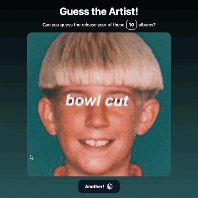

# Web Development Project 2 - *Guess the Year!*

This web app is a small flashcards game where the player is meant to guess the release year of the albums shown.

Submitted by: **Rafael Niebles**

Time spent: **3** hours spent in total

## Required Features

The following **required** functionality is completed:

- [x] **The title of the card set and some information about it, such as a short description and the total number of cards are displayed**
- [x] **A single card at a time is displayed, only showing one of the components of the information pair**
- [x] **A list of card pairs is created**
- [x] **Clicking on the card shows the corresponding component of the information pair**
- [x] **Clicking the next button displays a random new card**

The following **optional** features are implemented:

- [x] Cards contains images in addition to or in place of text
- [x] Cards have different visual styles such as color based on their category
    > The app's accent color changes based on the current card! 

## Video Walkthrough

Here's a walkthrough of implemented required features:

## Notes

The most challenging part was the CSS for the flip card effect. I took the time to try and figure it out myself to practice styling, and I learned a lot about 3D transformations in CSS!

## License

    Copyright [2025] [name of copyright owner]

    Licensed under the Apache License, Version 2.0 (the "License");
    you may not use this file except in compliance with the License.
    You may obtain a copy of the License at

        http://www.apache.org/licenses/LICENSE-2.0

    Unless required by applicable law or agreed to in writing, software
    distributed under the License is distributed on an "AS IS" BASIS,
    WITHOUT WARRANTIES OR CONDITIONS OF ANY KIND, either express or implied.
    See the License for the specific language governing permissions and
    limitations under the License.
