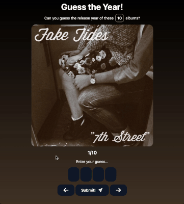

# Web Development Project 3 - *Guess the Year Part II!*

This web app improves upon the originally implemented card game for part I by adding interactivity. Users are now able to input answers and check whether they're right or wrong! 

Submitted by: **Rafael Niebles**

Time spent: **6** hours spent in total

## Required Features

The following **required** functionality is completed:

- [x] The user can enter their guess in a box before seeing the flipside of the card
- [x] Clicking on a submit button shows visual feedback about whether the answer was correct or incorrect
- [x] A back button displayed on the card can be used to return to the previous card in a set sequence
- [x] A next button displayed on the card can be used to navigate to the next card in a set sequence

The following **optional** features are implemented:

- [x] The user inputs their answer in a special component tailored for digit-wise input, akin to the iPhone's passcode UI, that snappily shifts focus between number boxes as needed. 

## Video Walkthrough

Here's a walkthrough of implemented required features:

## Notes

Implementing the passcode-like year input was very, very difficult, but I learned a *lot* about React state-setting, React references, and element focus!

Initially, I drew up an approach that separated the input, state update, and focus-shifting functionality between `keyDown`, `onChange`, and `keyUp` handlers, but that caused some keystrokes to not be captured. 

After much trial and error, I figured out how to make it snappy and responsive by limiting input capture to `keyDown` only, since what was causing input capture fails was `onKeyUp` failing to run before we finished the previous keystroke.

I also learned that `setState` is *not* synchronous, which caused issues I first dealt with by incorporating safeguards but then just avoided altogether by not using a state-based index at all. 

## License

    Copyright [2025] [name of copyright owner]

    Licensed under the Apache License, Version 2.0 (the "License");
    you may not use this file except in compliance with the License.
    You may obtain a copy of the License at

        http://www.apache.org/licenses/LICENSE-2.0

    Unless required by applicable law or agreed to in writing, software
    distributed under the License is distributed on an "AS IS" BASIS,
    WITHOUT WARRANTIES OR CONDITIONS OF ANY KIND, either express or implied.
    See the License for the specific language governing permissions and
    limitations under the License.
